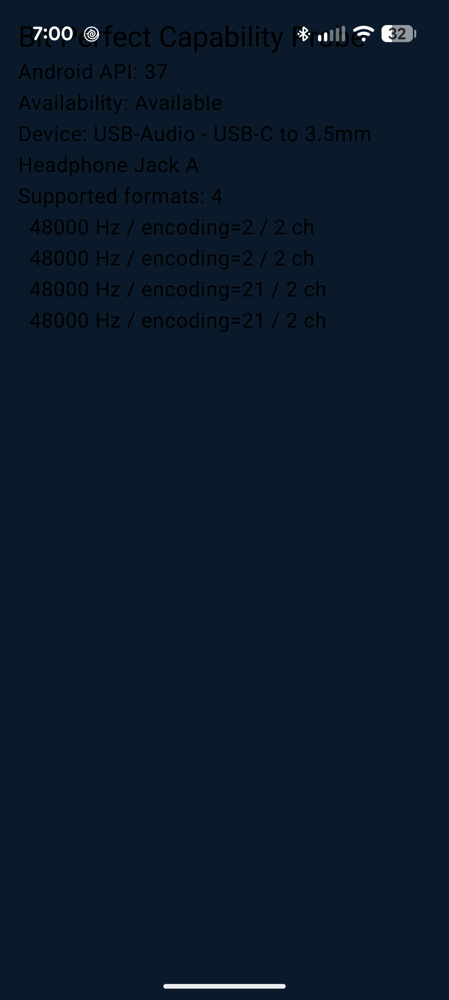

# Phase 2b B0 — Bit-Perfect Capability Probe Result (Pixel 10 Pro XL)

**Verdict: `PROBE_PASS`** — Stream B (bit-perfect Android) is **greenlit**.

**Run date:** 2026-06-19
**Gate:** Plan §3 G1 + §7 B0-T4..T7 ([`../superpowers/plans/2026-05-23-phase-2b-plan.md`](../superpowers/plans/2026-05-23-phase-2b-plan.md)).
**Enforces:** F11 (probe-gate). This file's existence in `main` is the hard precondition for creating `BitPerfectAudioTrackPlayerImpl.kt`.

---

## Device under test

| Field | Value |
|---|---|
| Model | **Pixel 10 Pro XL** (`mustang`) — Tensor G5 |
| Android | **17** (API **37**) |
| Build | `CP2A.260605.012` |
| Fingerprint | `google/mustang/mustang:17/CP2A.260605.012/15430684:user/release-keys` |

## USB DAC under test

| Field | Value |
|---|---|
| Reported name | `USB-Audio - USB-C to 3.5mm Headphone Jack A` |
| Type | `TYPE_USB_HEADSET` (`0x4000000`), ALSA `card=1;device=0` |
| Class | Generic Google USB-C-to-3.5mm dongle — active UAC DAC (fixed-function, ~48 kHz class) |
| Enumeration | Confirmed independently via `dumpsys audio`: `setWiredDeviceConnectionState(... usb_headset) ... from UsbAlsaDevice`, `DEVICE_STATE_AVAILABLE` |

## Method

- Pixel 10 connected over **wireless adb** (single USB-C port is occupied by the dongle → dongle XOR cable → wireless is mandatory). Pair-with-code flow; phone on same `192.168.50.0/24` subnet as Cortex.
- `BitPerfectProbeActivity` (debug build) launched from the current-HEAD debug APK (built from `d836338`, the PR #22 probe merge).
- Probe path: `AudioManager.getDevices(GET_DEVICES_OUTPUTS)` → first `TYPE_USB_*` device → `getSupportedMixerAttributes(device)` → filter `MIXER_BEHAVIOR_BIT_PERFECT`.

## Result

```
Bit-Perfect Capability Probe
Android API: 37
Availability: Available
Device: USB-Audio - USB-C to 3.5mm Headphone Jack A
Supported formats: 4
  48000 Hz / encoding=2  / 2 ch      ← ENCODING_PCM_16BIT
  48000 Hz / encoding=2  / 2 ch
  48000 Hz / encoding=21 / 2 ch      ← ENCODING_PCM_24BIT_PACKED
  48000 Hz / encoding=21 / 2 ch
```



- **Availability: `Available`** — Tensor G5 exposes `MIXER_BEHAVIOR_BIT_PERFECT`. ≥1 bit-perfect format ⇒ **PROBE_PASS** per the §3 G1 unlock criterion.
- **16-bit and 24-bit-packed both confirmed.** (The 2× duplication of each entry is a `getSupportedMixerAttributes` listing quirk, not two distinct capabilities.)

## Critical caveat — 48 kHz ceiling is the DONGLE, not the phone

Every returned format is **48000 Hz**. Nothing at **44.1 / 88.2 / 96 / 176.4 / 192 kHz**.

This is attributed to the **generic USB-C-to-3.5mm dongle** (a fixed-function ~48 kHz UAC1-class DAC), **not** a Pixel 10 / Tensor G5 limitation — the bit-perfect HAL passes through whatever the connected USB DAC declares it supports. The phone's true bit-perfect rate ceiling is **unknown** and requires a capable DAC to establish.

Consequence: Clay's library is predominantly hi-res (44.1 / 88.2 / 96 / 176.4 / 192). With *this* dongle, bit-perfect would only genuinely engage on native-48 kHz tracks; all other rates would resample to 48 kHz, defeating the contract. This is a real-hardware preview of plan risks **F6** (per-track sample-rate negotiation) and partially **F25** (non-48k rate handling).

## Decision

1. **Gate cleared — Stream B greenlit.** `BitPerfectAudioTrackPlayerImpl.kt` may now be created (F11 satisfied by this doc).
2. **Dispute resolved empirically.** The G2 Gemini-vs-Codex disagreement on whether Pixel 10 ships bit-perfect enabled is settled in **Gemini's** favor; Codex's "unconfirmed, do not assume enabled" caution was overcautious on the core question. No further research-quota tie-break needed.
3. **B2 null-test format matrix cannot be fully validated with this dongle.** The plan's acceptance set `{44.1/16, 48/16, 96/24, 192/24}` needs a DAC that declares those rates. **Action item:** re-probe with a proper hi-res USB DAC (iFi / FiiO / Topping class) before locking the B2 matrix — establishes the phone's real rate ceiling and unblocks meaningful bit-perfect listening on the hi-res library. Clay has no such DAC on hand as of this run (acquisition is a prerequisite for B2).

## Sign-off

Clay confirmed the `PROBE_PASS` verdict and the 48 kHz-dongle caveat on 2026-06-19.

---

**Related:** engram `decision/kiln-phase-2b-b0-real-gate-result-2026-06-19`; supersedes the uncertainty in `architecture/kiln-phase-2b-g2-gemini-cross-check`.
